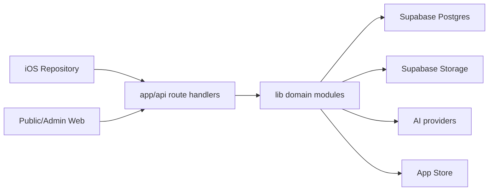

# Tuji Web Architecture

更新日期：2026-08-12

## 1. 定位

`tuji-web` 同時是：

- iOS App 的權威 API provider。
- 詞庫與學習資料服務。
- 自製圖鑑與物見的 UGC／AI 後端。
- 公開 Web 頁面與內部管理後台。
- StoreKit 訂閱驗證、權限與配額服務。

正式 API 的 response shape、語言作用域、快取與權限都是跨 iOS／Web 合約。

## 2. 技術棧

| 層 | 技術 |
|---|---|
| Framework | Next.js 14.2 route handlers |
| Runtime | Node on Vercel |
| DB / Auth / Storage | Supabase Postgres、Auth、Storage |
| AI | Vercel AI SDK、OpenAI gateway、Google Vision |
| Billing | App Store Server Library、ASSN V2 |
| UI | React 18、Tailwind |

## 3. 邊界



- Route handler：驗證身份、解析 request、選 cache/HTTP status、組 response。
- `lib/*`：資料庫與產品規則；複雜 Atlas 流程再下沉到 `lib/atlas/*`。
- Client 不得傳入或決定權威 user id、tier、review status。

## 4. 語言與搜尋

Tuji 有兩個正交作用域：

- `lang`：介面／釋義語言，值域為 `zh-Hant`、`zh-Hans`、`ja`、`en`。
- `learning`：學習方向，值域為 `zh-en`、`zh-ja`。

方向相關 API（search、progress、mastery、study queue/stats 等）優先採用 request 明示的作用域；舊 client 未帶參數時才回退到伺服器設定。搜尋的 process cache key 同時包含 query、limit、`lang` 與 `learning`，避免切換學習語言後讀到上一方向的結果。

日文詞條由 `lib/kana.ts`、`lib/ja-reading.ts` 與字典／override 層產生 `readingSegments`。可信切分可由 iOS 把假名標在對應漢字上；無可信切分時保留獨立 reading 行。

## 5. Auth 與帳號

Web 支援 cookie session，iOS 使用 Bearer access token。所有 user-scoped route 都在 server side 解析當前使用者，不能相信 request body 的 user id。

公開身分使用不可變 TJ UID 作為 handle；暱稱、簽名與頭像由 profile 編輯流程審核後更新。作者主頁、合集與公開項目共用這份投影。

封鎖名單透過 `/api/users/blocks` 與 `/api/users/blocks/:handle` 保存到帳號。公開物見 GET 保持匿名且可共享快取，iOS 下載小型封鎖清單後在 discovery 層過濾；既有收藏與 SRS 歷史不會被刪除。

## 6. Cache

`next.config.js` 集中設定主要 HTTP cache header，`lib/cache-headers.ts` 提供 ETag/304 與語言作用域 helper。

- Public：詞庫、分類、完整帶 `lang`/`learning` 的搜尋、物見公開列表／詳情／作者／合集。
- Private/no-store：`/api/users/*`、`/api/study/*`、`/api/events`、billing、admin 與所有寫入。
- 公開 URL 必須完整表達回應作用域；缺少語言參數、需要讀使用者設定時不可當成共享快取鍵。

## 7. Study

Study 路由提供 queue、answer、stats 與 reports，並合併公版、自製與已收藏物見內容。

- `/api/study/answer` 更新卡片 SRS、word mastery 與 study log；log 寫入失敗不使核心答題失敗。
- 複習翻面求救會傳 `hinted: true`，保存在 `study_logs.metadata`，不新增 activity enum。
- 答題後主動 revalidate 該使用者的 progress/stats tag，避免同一節完成頁讀到 30 秒舊快取。
- 學習方向由 request 決定，舊版請求才回退到帳號設定。

## 8. Atlas、物見與審核

私人創作與公開消費是兩條不同資料路徑：

- 私人：upload → recognize → confirm → cards/enrich → sync。
- 公開：作者建立合集並送審；通過後出現在物見、作者主頁、合集詳情與單字頁「大家的圖鑑」。
- 消費：收藏單項／合集、整批加入學習、取消收藏。

項目與合集各有 submission pipeline。圖片與文字經 moderation policy 得出 `approved`、`pending_review` 或 `rejected`，事件寫入 moderation event；admin 可人工批准、退回或下架。

檢舉覆蓋公開項目、合集與作者。高風險理由或累積門檻可把內容升級到人工處理，並通知管理端。iOS 只有在伺服器接受後才顯示「已收到檢舉」。

## 9. Billing 與有效權限

`user_entitlements` 只保存 App Store 訂閱來源；`user_entitlement_grants` 保存營運手動贈與。`resolveEntitlement` 取兩者聯集：任一有效即為 Pro，較晚的到期日生效。

- 訂閱由 verify 與 App Store notification 更新。
- 同一 `original_transaction_id` 只綁一個 Tuji 帳號；重新綁定會釋放舊帳號。
- 贈與與收回都要求理由，不會修改或取消真實訂閱。
- `user_entitlement_events` 保存異動歷史；營收與退款仍以 App Store Connect 為準。
- 自製格數、普通 AI、高精度 AI、物見收藏各有獨立限制。

## 10. Admin

`app/admin` 提供詞庫、study reports、feedback、Atlas 項目／合集審核、Atlas reports、漏斗、會員權限與統計。管理寫入一律走 `/api/admin/*`，驗證 admin 身份，不能把 service role client 暴露到 client component。

## 11. Build 與 migration

```bash
npm test
npm run build
npm run vercel-build
```

Vercel build 先執行 `scripts/migrate.ts`。Migration 必須可重入；資料修復與大量回填使用獨立 script，不應塞進每次 request。
